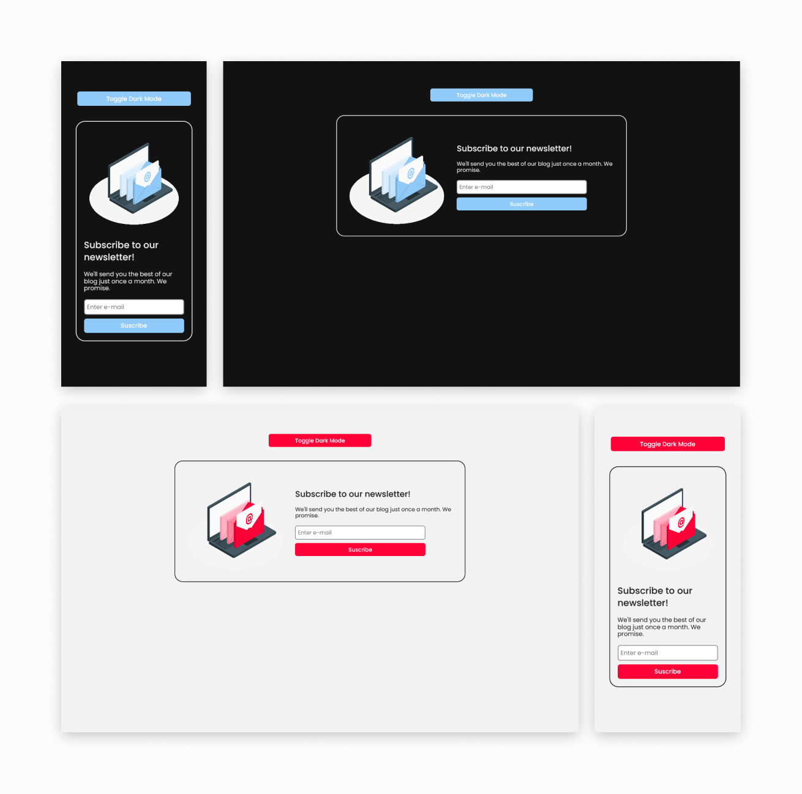

# Light to Dark Responsive Newsletter

A newsletter snippet, part of the light to dark codepen challenge. Uses Javascript to change the CSS classes and add a dark theme to the elements.

The CSS methodology that I used is BEM and implemented with SASS.

You can see the result on [codepen](https://codepen.io/Javieer57/pen/GREmKrm).

## Screenshot



## What I learned

I found custom properties so helpful to changed the colors in the project quickly and easily. I start to use this more in the future.

```scss
// Default colors
body {
	--text-color: #222;
	--secondary-color: #ff0037;
	--bkg-color: #f2f2f2;
}

// Dark theme colors
body.dark-theme {
	--text-color: #eee;
	--secondary-color: #90caf9;
	--bkg-color: #121212;
}
```

## Credits

I based the project on the design of [@csscoding](https://www.instagram.com/csscoding_/) and the [CSS tricks guide](https://css-tricks.com/a-complete-guide-to-dark-mode-on-the-web/) to learn how to change between dark mode.

The images came from the [Storyset](https://storyset.com/internet) page.

## Author

-   Frontend Mentor - @Javieer57
-   Github - @Javieer57
-   Instagram - @javieer57
-   Web - [javieereufracio.com](https://www.javieereufracio.com/)
